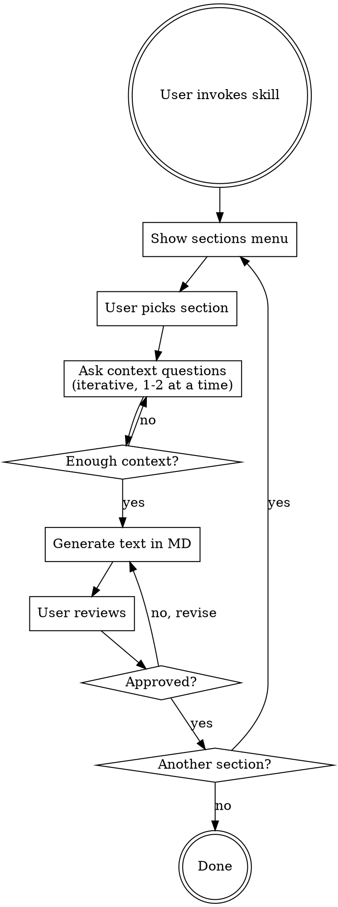

# Writing EU R&D Funding Applications

Interactive skill for filling out R&D grant application sections (Ścieżka SMART / FENG). Generates ready-to-paste text with proper Frascati terminology for IT/software projects.

## When to Use

- Filling out sections of EU funding applications (SMART, FENG, NCBR, PARP programs)
- Describing R&D activities in grant proposals
- Classifying tasks as industrial research vs experimental development
- Writing about innovation, R&D methodology, or research teams for grants
- Need proper Frascati Manual terminology and phrasing

## When NOT to Use

- Business plans or pitch decks (different language and structure)
- Academic papers or scientific publications
- Tax relief (ulga B+R) documentation (different requirements)

## Process

## Step 1: Show Sections Menu

Present this menu when starting. User picks a section by number or name.

| # | Section | Character Limit | Typical Input |
|---|---------|----------------|---------------|
| 1 | **Krótki opis projektu** | 4000 zn. | Plan projektu, README, opis pomysłu |
| 2 | **Problem badawczy/technologiczny** | 5000 zn. | Co nie działa, czego brakuje w obecnych rozwiązaniach |
| 3 | **Stan wiedzy na świecie** | 2000 zn. | Konkurenci, istniejące rozwiązania, literatura |
| 4 | **Potrzeby odbiorców** | 2000 zn. | Rynek docelowy, feedback użytkowników |
| 5 | **Metoda badawcza** | 5000 zn. | Architektura, tech stack, plan prac, podejście |
| 6 | **Innowacyjność rezultatu** | 10000 zn. | Parametry techniczne, porównanie z konkurencją |
| 7 | **Zespół projektowy** | per osoba | Lista osób, role, doświadczenie, CV |
| 8 | **Harmonogram i kamienie milowe** | per zadanie 5000 zn. | Etapy prac, deliverables, timeline |
| 9 | **Klasyfikacja prac (BP vs PR)** | -- | Opis zadań → klasyfikacja wg TRL |
| 10 | **Ryzyka i scenariusze alternatywne** | -- | Znane ryzyka technologiczne |
| 11 | **Wskaźniki innowacyjności** | -- | Parametry techniczne do zmierzenia |

## Step 2: Context Gathering (per section)

Ask questions **1-2 at a time**. Do not dump all questions at once. Adapt follow-ups based on answers.

### Section-specific questions

**1. Krótki opis projektu:**
- Co budujesz? (opis w 2-3 zdaniach, kod, README)
- Jaki problem rozwiązujesz?
- Kto jest odbiorcą?
- Jaki typ innowacji: produktowa (nowy produkt/usługa) czy procesowa (nowy proces biznesowy)?

**2. Problem badawczy/technologiczny:**
- Co konkretnie nie działa / jest nierozwiązane w obecnych rozwiązaniach?
- Dlaczego istniejące podejścia są niewystarczające? (parametry, ograniczenia)
- Co sprawia, że rozwiązanie nie jest oczywiste? (→ nieprzewidywalność Frascati)
- Czy masz dane liczbowe pokazujące skalę problemu?

**3. Stan wiedzy na świecie:**
- Jakie rozwiązania istnieją na rynku? (nazwy, producenci)
- Jakie podejścia naukowe/technologiczne próbowano?
- Co dokładnie te rozwiązania robią źle / czego im brakuje?
- Czy masz źródła: publikacje, patenty, benchmarki?

**4. Potrzeby odbiorców:**
- Kim są docelowi użytkownicy? (segment, wielkość rynku)
- Skąd wiesz, że ta potrzeba istnieje? (badania, feedback, dane)
- Jak dziś radzą sobie bez Twojego rozwiązania?

**5. Metoda badawcza:**
- Jaki jest Twój tech stack / architektura?
- Jakie podejście metodologiczne przyjmujesz? (np. iteracyjne prototypowanie, eksperymenty A/B, walidacja na zbiorach danych)
- Jakie etapy/fazy przewidujesz?
- Dlaczego to podejście, a nie inne?

**6. Innowacyjność rezultatu:**
- Jakie konkretne parametry techniczne będą lepsze? (wydajność, dokładność, czas, skalowalność)
- Od jakiego rozwiązania konkurencyjnego się odróżniasz? (nazwa, producent)
- Podaj wartości: obecna (bazowa) vs docelowa dla każdego parametru
- Co Twoje rozwiązanie potrafi, czego inne nie potrafią?

**7. Zespół projektowy:**
- Ile osób? Role? (kierownik B+R, dev, data scientist, PM)
- Doświadczenie w B+R z ostatnich 5 lat (publikacje, patenty, projekty)
- Wymiar zaangażowania (etaty/godziny)
- Kto ma doświadczenie we wdrażaniu wyników B+R?

**8. Harmonogram i kamienie milowe:**
- Ile trwa projekt? (miesiące)
- Jakie główne etapy? Co jest deliverable każdego?
- Co jest mierzalnym dowodem ukończenia etapu? (prototyp, wyniki testów, raport)
- Które zadania to badania przemysłowe, a które prace rozwojowe?

**9. Klasyfikacja prac:**
- Opisz każde zadanie/etap projektu
- Skill klasyfikuje wg TRL i przypisuje do BP lub PR (patrz reference.md)

**10. Ryzyka:**
- Co może się nie udać technicznie?
- Jakie alternatywne podejścia rozważasz?
- Co zrobisz jeśli główna hipoteza się nie potwierdzi?

**11. Wskaźniki innowacyjności:**
- Jakie parametry techniczne mierzysz?
- Jak je zmierzysz? (benchmark, testy, metryki)
- Wartość bazowa (stan obecny) vs docelowa

## Step 3: Generate Text

### Output format
- Generate as **Markdown** with tables where applicable
- Include **character count** at the end of each section
- Use proper Frascati terminology naturally woven into text (see reference.md for phrase bank)
- Write in **Polish** (formal, third person or first person plural "Wnioskodawca planuje..." / "W ramach projektu...")

### Quality checklist before outputting

For every generated section, mentally verify:

| Check | Question |
|---|---|
| **Frascati: Nowatorskość** | Czy tekst wyraźnie wskazuje element NOWEJ wiedzy? |
| **Frascati: Twórczość** | Czy widać oryginalne, nieoczywiste podejście? |
| **Frascati: Nieprzewidywalność** | Czy zidentyfikowano niepewność co do wyniku? |
| **Frascati: Systematyczność** | Czy prace są zaplanowane, z metodą i budżetem? |
| **Frascati: Transferowalność** | Czy wyniki będą udokumentowane i możliwe do odtworzenia? |
| **Nie-rutynowość** | Czy NIE opisujesz standardowego developmentu IT? |
| **Konkretność** | Czy są liczby, parametry, nazwy konkurentów? |
| **Limit znaków** | Czy mieścisz się w limicie sekcji? |

### Anti-patterns in IT/software R&D descriptions

**NEVER describe these as R&D** (evaluators will reject):
- Building websites/apps using known frameworks (React, Angular, Django)
- Standard CRUD operations, REST API implementation
- Routine debugging, testing, code review
- Integrating existing APIs/libraries without novel approach
- Deploying to cloud, setting up CI/CD
- UI/UX design without novel interaction paradigm
- Data migration, system administration

**ALWAYS frame IT work as R&D by showing:**
- Novel algorithm or method that doesn't exist yet
- Uncertainty about whether approach will achieve required parameters
- Creative combination of techniques not previously attempted together
- New knowledge generated (not just new code)
- Results that can be documented and reproduced

## Common Mistakes

| Mistake | Fix |
|---|---|
| "Stworzymy innowacyjną platformę" (no specifics) | Name concrete parameters: "accuracy >95%, latency <100ms" |
| No competitor named | Always name specific competitor + product: "System X firmy Y" |
| Describing standard development as R&D | Focus on WHAT IS UNKNOWN, not what you'll build |
| Missing uncertainty | Add: "Nie jest pewne, czy... / Istnieje ryzyko, że..." |
| Mixing industrial research with development work | Use TRL to classify: TRL 2-4 = BP, TRL 5-8 = PR |
| Indicators without baseline values | Always: "wartość bazowa: X → wartość docelowa: Y" |
| Team without R&D experience | Highlight publications, patents, past R&D projects |
| Milestones not measurable | Each milestone = measurable deliverable + verification method |

## Reference

Heavy reference material (Frascati criteria details, TRL table, SMART scoring, phrase bank, definitions, limits) is in `reference.md` in this directory. Consult it when generating text.
